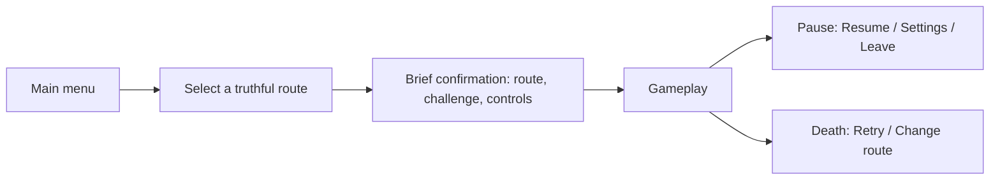

# RUN//UNIT — in-game menu UX review

**Review date:** 2026-09-14
**Scope:** main menu, sector selection, route briefing, pause, death/recovery, and Options.
**Outcome:** review only. No production menu code or art was changed.

## Executive summary

RUN//UNIT already has a convincing visual language: a restrained near-black backdrop, teal information surfaces, orange emphasis, and a highly visible yellow keyboard-focus ring. The main menu, sector selector, pause screen, death screen, and Options screen all read as parts of the same product. The base desktop composition is clean, the primary action is generally easy to find, and the focused control is unambiguous.

The most important work is not a visual reskin. It is to make the menu's promises, instructions, and live behavior agree. At present the sector screen tells the player that **Tab deploys** even though the screen's custom input handler only implements arrows and Cancel; deployment happens through normal button activation. The Options screen lists **Toggle Debug — F1**, while gameplay listens directly for **F3**. The sector selector also advertises eight authored routes with different hazards and threat levels, while `StaticWorld.set_level_profile()` is currently empty, so every choice is routed into the same authored `world.tscn` content. These are trust and learnability problems: visually successful UI can still lead a player to perform the wrong action or expect content that is not there.

The recommended direction is to preserve the existing terminal-like identity while simplifying the information architecture around a single, truthful start flow; normalizing language and input hints; separating destructive actions; and explicitly deciding whether the game is fixed 16:9 desktop-only or needs responsive behavior beyond that target.

## How to read this review

### Priority definitions

| Priority | Meaning |
| --- | --- |
| **P1** | A player can be misled, blocked, or have a core expectation broken. Fix before a broadly tested build. |
| **P2** | Material clarity, recovery, consistency, or platform-readiness issue. Plan in the next UI pass. |
| **P3** | Useful polish or an audit item; address after P1/P2 work. |

### Evidence and constraints

I inspected the Godot scenes, scripts, global theme, input map, and authored UI states, then rendered the following deterministic screenshots:

| Surface | State reviewed | Result at the authored base size |
| --- | --- | --- |
| Main menu | default focus | 960 × 540; clear hierarchy and visible focus |
| Sector selector | default focus and attempted Tab navigation | 960 × 540; no structural overlap or clipping detected |
| Route briefing | direct scene render | 960 × 540; visually polished but not reached by the current game flow |
| Pause | default focus | 960 × 540; no structural overlap or clipping detected |
| Death/recovery | live game death state | 960 × 540; primary recovery action is prominent |
| Options | Controls tab | 960 × 540; functional input list, including player-facing debug row |

The layout checker reported only intended stacked decorative layers in the main/briefing scenes. It also reported distant world tutorial labels outside the viewport while testing the death state; those labels are world-space tutorial content, not a death-menu defect.

I attempted wide and portrait scenarios. The project settings fix both the viewport and window override to `960 × 540` (`project.godot:26–30`), so the tool could not validate a true wide/tall adaptive layout. The portrait request produced a `540 × 303` 16:9 capture, while the UI report continued to lay out controls at `960 × 540`. Therefore this review does **not** claim the menus are responsive outside their authored desktop canvas.

### UX-book reference, not an instruction source

The supplied *The UX Book* was used only as a reference framework. Its discussion of user goals and measurable targets, mental models and affordances, and formative evaluation informed the criteria below. Nothing in the document was treated as an instruction or authorization to change the project. The review especially asks: can a first-time player predict what each control will do, recover from an interruption, and complete a task without remembering hidden rules?

## What is working well

### A coherent, legible visual system

The global `run_unit_menu_theme.tres` uses a dark surface with pale cyan labels, teal boundaries, orange emphasis, and a yellow, high-contrast focus treatment. The same visual grammar carries across custom screens and template-backed menus. The main menu's central stack, the selector's selected sector, and the death screen's retry action are easy to scan at 960 × 540.

This is more than decoration: the orange/yellow treatment consistently tells a keyboard player where they are. Buttons receive an explicit focus style in the theme, and the selector creates controls with `FOCUS_ALL` and focuses the first sector after it is built (`scripts/ui/run_unit_level_selector.gd:20–36`).

### Good keyboard-first foundations

The selector updates the mission briefing when a sector gains focus, not only when it is clicked (`scripts/ui/run_unit_level_selector.gd:61–77`). That is a sound pattern: arrow-key movement has immediate, visible consequences. The pause-menu infrastructure also uses an exclusive popup and restores focus through the menu template, which is the right basis for a temporary interruption.

### Recovery is visible in the failure state

The death screen puts **RETRY ROUTE** first and gives it focus. Route identifier, run distance, and best distance are displayed before the two recovery choices. The screen is calm and easy to parse compared with the playfield behind it.

### Options are substantially functional rather than decorative

The Options render exposes bindings in a clear row-and-column layout, gives bindings a generous 49 px control height, and groups Controls, Audio, and Video. This is a productive starting point for a settings flow.

## Findings and recommendations

### P1 — The sector selector's instruction contradicts its interaction

**Location:** `scenes/level_selector.tscn:203`; `scripts/ui/run_unit_level_selector.gd:38–81`.

**Evidence.** The footer says `ARROWS SELECT   TAB DEPLOY   ESC BACK`. The custom `_input()` method implements `ui_up`, `ui_down`, `ui_left`, `ui_right`, and `ui_cancel`; it contains no Tab/`ui_focus_next` deployment behavior. Selecting a sector with normal button activation merely moves focus to Deploy (`_on_sector_pressed`, lines 64–66); the deploy scene transition happens only when the Deploy button is pressed (lines 79–81).

**Why it matters.** This is a false cognitive affordance: the UI teaches a shortcut that does not perform the promised action. A new keyboard player can reasonably believe they are blocked after following the written instruction.

**Recommendation.** Choose one model and make all surfaces agree:

1. Preferred: display `ARROWS SELECT · ENTER / SPACE DEPLOY · ESC BACK`, and let normal focus plus `ui_accept` activate the selected sector/Deploy control.
2. If Tab-to-deploy is deliberately desired, implement that exact behavior, only when a sector has focus, and retain an on-screen prompt such as `TAB: DEPLOY SELECTED ROUTE`.
3. Avoid hard-coded labels. Generate the shown keyboard/controller hint from the same InputMap actions the UI actually consumes.

**Acceptance check.** From the first selected sector, a first-time player follows the footer literally and reaches gameplay without guessing. Test keyboard, controller, and mouse paths separately.

### P1 — The control list exposes an inaccurate, developer-facing debug binding

**Location:** Options → Controls; `project.godot:68–71`; `scripts/gameplay/game.gd:52–66`.

**Evidence.** The rendered Controls tab lists `Toggle Debug` bound to F1. The live gameplay HUD advertises `F3 DEBUG`, and gameplay toggles the overlay using a direct `KEY_F3` test rather than the configurable `toggle_debug` action. The player is shown a remappable-looking setting that does not match the game behavior.

**Why it matters.** An input-settings screen is a contract. When a visible binding is wrong, players learn that the rest of the controls may be unreliable. Showing developer tooling in a player menu also makes the build appear unfinished.

**Recommendation.** For a player build, remove debug/Bot rows entirely from the Options action list and debug HUD hint. For an internal build, gate them behind a development flag and make the game read `Input.is_action_just_pressed("toggle_debug")` instead of a hard-coded key. If F3 is the intended binding, make the InputMap and row say F3.

**Acceptance check.** Every input item visible in Options performs the described action in gameplay, and no development-only command appears in a release configuration.

### P1 — Sector descriptions promise differentiated routes that are not currently differentiated in gameplay

**Location:** Sector selector; `scripts/ui/run_unit_level_selector.gd:5–7, 73–77`; `scripts/world/static_world.gd:20–21`.

**Evidence.** Eight sectors are described with strongly different environments, traversal conditions, and threat levels—from unstable lift shafts to wind shear and “no second chances.” The game passes the selected index to `world.set_level_profile()`, but the current function body is `pass`. The selected session then begins in the same `world.tscn` static content.

**Why it matters.** The selector communicates a meaningful choice, difficulty progression, and replay value. If choice does not alter the route, the strongest piece of mission information is fiction rather than decision support. This is especially damaging once players compare notes or retry another sector.

**Recommendation.** Make one of these states explicit now:

| Product state | UI treatment |
| --- | --- |
| Distinct routes are imminent | Lock unreleased sectors, show `COMING SOON` and a truthful unlock condition, and do not assign fabricated threat/difficulty. |
| One route is the current game | Present one playable `Municipal Core Route`; move future sector names into non-interactive Intel/roadmap content, if desired. |
| Multi-route launch is intended | Implement per-sector world/profile data before exposing all eight options; route hazards, selected name, difficulty, and post-run record must all derive from the same source. |

**Acceptance check.** Choosing any visible playable sector changes at least the content, rule set, challenge tier, or seed in a way that the briefing describes; otherwise it is not presented as a distinct playable route.

### P2 — Two incompatible pre-run experiences exist, and the stronger briefing is currently unreachable

**Location:** `scenes/title_screen.tscn`, `scenes/level_selector.tscn`, `scenes/game.tscn`, and `scripts/gameplay/game.gd:25–35, 96–111`.

**Evidence.** The rendered route briefing is a polished scene with story context, sector selection, and a large `BEGIN SELECTED ROUTE` call-to-action. The actual flow is Main menu → Sector selector → Game; in `_ready()` the game starts the run then immediately calls `title_screen.close()`. `_show_title_screen()` exists but has no call site, and the title scene's `start_requested` signal has no connection in `game.tscn`.

**Why it matters.** There are two mental models of how a run starts: a pragmatic sector-selection screen and a narrative dispatch terminal. The live product uses only the former, while the latter consumes maintenance effort and can cause future flow regressions.

**Recommendation.** Deliberately choose one start flow:

The best fit is to retain the current selector's efficient route choice and use the briefing only as a short confirmation panel or optional `Route Intel` view. Do not make players choose the same sector twice. Delete, connect, or consolidate the unreachable scene so there is one source of truth for sector labels, descriptions, buttons, and first focus.

**Acceptance check.** A design owner can trace exactly one user path from **Start New Run** to the live run. No unconnected menu scene remains in the shipped flow.

### P2 — The menu labels use compelling fiction, but sometimes hide the familiar action

**Location:** Main menu, pause menu, and window titles; `scripts/ui/run_unit_main_menu.gd:10–13`; `menus/scenes/windows/pause_menu.tscn:35–51`.

**Evidence.** The main menu says `SYSTEM SETTINGS` and `SHUT DOWN`; the pause menu says `Options` among all-caps labels and `QUIT DESKTOP`; the window title is `Options`. These are understandable, but three labels refer to overlapping system/exit concepts in different language and capitalization.

**Why it matters.** The game voice is strong, but unfamiliar verbs make a player pause at a moment that should be immediate. Exit actions deserve exact wording because the consequence is material.

**Recommendation.** Lead with the conventional task, then add the in-world flavor if wanted:

| Current | Recommended |
| --- | --- |
| `SYSTEM SETTINGS` | `SETTINGS` or `SETTINGS // SYSTEM` |
| `CREDITS / INTEL` | `CREDITS & INTEL` |
| `SHUT DOWN` | `QUIT TO DESKTOP` |
| `Options` | `SETTINGS` (match the main menu and capitalization convention) |
| `QUIT DESKTOP` | `QUIT TO DESKTOP` |

Use `Settings` consistently in the menu, pause menu, and modal title. Keep the terminal vocabulary in subtitles, status labels, and visual tone rather than making it do all the instructional work.

### P2 — Pause actions need a clearer safety hierarchy

**Location:** Pause popup (`menus/scenes/windows/pause_menu.tscn`), rendered 256 × 398 panel.

**Evidence.** Resume, restart, Options, main menu, and desktop quit are visually identical, contiguous buttons. Resume gets initial focus, and confirmation dialogs exist for restart/main menu/quit, which are good safeguards; however the action list offers no visual grouping between reversible, run-ending, and application-ending actions.

**Why it matters.** Players often pause under pressure. In that context, spatial grouping and tone should reduce the chance of an accidental high-cost action before the confirmation dialog needs to rescue it.

**Recommendation.** Keep `RESUME` as the large, initial-focus primary action. Put `SETTINGS` in a utility group separated by extra space. Move `RESTART ROUTE`, `RETURN TO MAIN MENU`, and `QUIT TO DESKTOP` into a separate “Leave current run” group, with the final desktop action using a distinct danger treatment. Confirmations should name the lost state and make the safe answer the default focus.

### P2 — The current window settings are an explicit fixed-16:9 desktop decision, not a responsive strategy

**Location:** `project.godot:26–30`; custom menu scenes.

**Evidence.** The authored 960 × 540 screens are balanced. The selector uses containers and scales cleanly inside that canvas. But the project sets `window_width_override` and `window_height_override` to the base size, preventing this review from exercising a true tall, wide, small-window, or touch layout. The portrait run is effectively a small 16:9 rendition; helper text and status information become tiny.

**Why it matters.** It is fine to ship desktop-only 16:9. It is not fine to leave the target implicit: Steam Deck, windowed desktop, ultrawide, accessibility scaling, and future mobile all require different decisions. A static canvas can turn readable 11–13 px labels into unreadable text when merely scaled down.

**Recommendation.** Make one explicit product call:

- **Desktop 16:9 only:** document a supported aspect/minimum resolution, enforce a sensible minimum window size, choose intentional letterboxing/scale behavior, and test 720p, 1080p, and a small window.
- **Multiple aspect ratios or touch targets:** remove the fixed override from validation builds, anchor full-screen roots, retain container-based groups, establish breakpoints (for example stack selector and briefing on narrow displays), add scrolling where required, and use a 44 logical-pixel minimum for touch-reachable controls.

In both cases, test the actual game window, not only logical Control rectangles.

### P2 — Options communicates available binding columns unclearly

**Location:** Options → Controls, rendered at 960 × 540.

**Evidence.** The `Primary`, `Secondary`, and `Tertiary` headings are clear, but unused secondary/tertiary slots render as large blank dark rectangles. A player cannot tell whether those boxes are unavailable, unbound click targets, or reserved space. The screen also shows a `Reset` action with only generic wording.

**Why it matters.** Empty fields invite uncertain experimentation and reduce the scan efficiency of a screen players visit to make a precise change.

**Recommendation.** Use one of the following explicit patterns: label each unused slot `+ Add binding`; show `Unbound` with a low-emphasis key-cap style; or hide unused columns until multi-binding is supported. Rename reset to `RESET CONTROLS`, add a confirmation only if it overwrites custom bindings, and state the effect in the confirmation copy.

### P3 — Small helper text and telemetry compete with essential reading

**Location:** main-menu footer/status (`scenes/main_menu.tscn:63–81`), route-briefing footer/top bar (`scenes/title_screen.tscn:205–293, 436–439`), and selector status/metadata.

**Evidence.** Several instructional or contextual labels use 10–13 px text at the base canvas. The route briefing is visually dense at 960 × 540, and its footer combines movement, charged jump, restart, build number, and product label in one thin line.

**Why it matters.** The chrome is attractive but should not make basic controls or route identity difficult to read at normal viewing distance. More terminal language is not necessarily more useful information.

**Recommendation.** Establish a compact type scale for the 960 × 540 target: at least 14 px for interactive guidance, 16–18 px for regular UI reading, and reserve 10–12 px for genuinely optional metadata. In the briefing, show only what the player needs before play; move build identifiers and non-actionable telemetry to Settings/About or a debug-only surface.

### P3 — The death screen can preserve more useful context without losing its calmness

**Location:** death/recovery overlay.

**Evidence.** The 90%-dark backdrop is visually controlled but makes the cause/context of the end almost disappear. The center copy is readable, though the run/best lines have equal emphasis even on a first run, when they are the same number.

**Recommendation.** Keep the focused retry button and sparse layout. Add a small outcome hierarchy: `Distance 128 m`, then `New best` **or** `Best 420 m (+292 m to beat)`. Optionally show a one-line immediate cause if the game can state it honestly. Use a slightly lighter contextual backdrop or a narrow frozen-playfield strip only if it helps the player understand the failure; do not add visual noise.

## Recommended menu specification

### Information architecture

| Player goal | Surface and primary action | Supporting information |
| --- | --- | --- |
| Start playing | **BEGIN RUN** → choose a real route → **DEPLOY** | Route name, accurate challenge/availability, short description |
| Adjust the game | **SETTINGS** | Controls, audio, video; player-facing actions only |
| Recover from a failure | **RETRY ROUTE** | Distance, best/delta, optional factual cause |
| Pause safely | **RESUME** | Settings as utility; leave/quit actions separated |
| Leave the game | **QUIT TO DESKTOP** | Explicit confirmation describing destination/state loss |

### Interaction and state rules

1. Every keyboard/controller hint must come from the same InputMap action that performs the function.
2. Every interactive control needs default, hover, focus, pressed, disabled, and—where applicable—selected states. Preserve the current yellow focus ring; add a deliberately muted disabled state and a distinct danger state.
3. The first safe/likely action receives focus when a modal opens: Resume in pause, Retry at death, first available route in route selection, and Close/Back when returning from a settings sub-window.
4. `Esc`/Cancel always backs out one level or closes the current modal; it must never silently discard a run.
5. Destructive actions use plain language, a separate visual group, confirmation, and a safe default response.
6. Selection information changes on focus as it does now, but activation is described separately and correctly.

### Visual system refinements

Keep the current palette and geometry. The valuable refinement is semantic consistency, not more effects:

- **Primary:** orange fill or strong outlined focus, reserved for Begin/Deploy/Resume/Retry.
- **Secondary:** teal outline, reserved for neutral navigation and settings.
- **Selected:** selected route uses a stable state that remains understandable even without color alone (for example, a check/`SELECTED` label or shape change).
- **Danger:** a distinct restrained red/orange danger token for application exit, never shared with normal deployment.
- **Metadata:** lower contrast only after size remains readable; do not use tiny type as the only distinction between optional and essential text.

## Validation plan after the redesign

### Task-based formative test

Run five or more short, moderated sessions with players unfamiliar with the build. Do not explain the controls first. Ask each participant to:

1. Start a run in the route they believe is most difficult.
2. Change a movement/jump control and verify it in play.
3. Pause, locate Settings, then return safely to the same run.
4. Recover after a death without returning to the desktop.
5. Explain what will happen before selecting Restart, Main Menu, and Quit.

Record completion, wrong activations, time to first deployment, whether the player reads the route data as a real gameplay promise, and any point where they ask what a label means. A good initial target is 100% completion of core tasks without facilitator correction and zero cases of a player following an on-screen shortcut that does not work.

### Automated and visual regression checks

- Capture main, selector, pause, death, and each Options tab at 960 × 540.
- If non-16:9/windowed support is a goal, capture at 1280 × 720, 1920 × 1080, a small supported window, an ultrawide case, and a tall/narrow case; inspect actual rendered output for clipping, text scale, focus visibility, and modal containment.
- Simulate keyboard, controller, and mouse routes to every primary action; assert the focused control and resulting scene/state.
- Verify Settings exposes only actions that are live in the active build.
- Test first-run, existing-best, and new-best death copy.

## Suggested implementation order

1. **P1 integrity pass:** correct the selector instruction, align/remove debug controls, and make sector availability truthful.
2. **Flow pass:** consolidate the unused route briefing and sector selector into one intentional start path.
3. **Safety/clarity pass:** normalize labels; group pause actions; label empty bindings; improve reset and exit confirmations.
4. **Platform/legibility pass:** declare supported display targets; test them; increase essential helper-text size where needed.
5. **Polish and research pass:** refine selected/danger/disabled tokens and run the task test before declaring the menu complete.

## Bottom line

The menu system has a solid visual foundation and better keyboard focus behavior than many early game UIs. Preserve that foundation. The highest-value improvement is to make every instruction, option, and sector claim true in the running game. Once the interaction contract is reliable, a smaller pass on action hierarchy, wording, and responsive targets will make the terminal aesthetic feel intentional rather than merely stylish.
